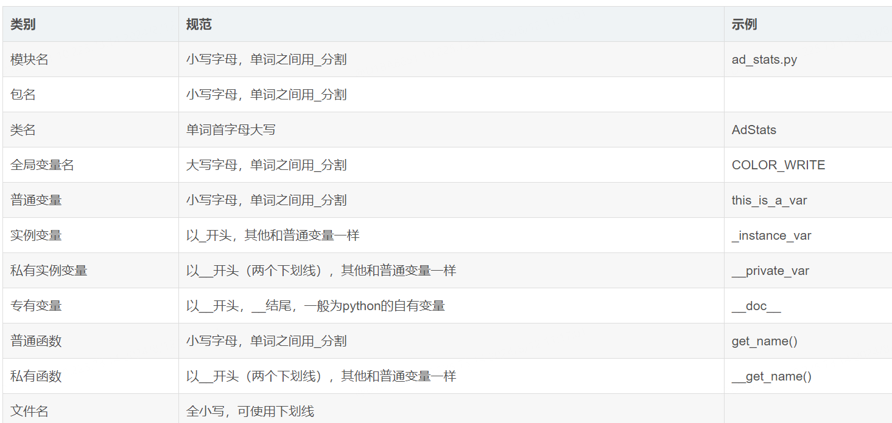

# 字符串和命名规范

1、字符串是不可变的数据类型

2、字符串有序可迭代：可以通过索引取值，可迭代指的是通过循环去取他的值

## 字符串增查改删

### 1、增加

test_str = "python001"

### 2、查找（访问字符串）

1、通过正序索引取值：从0开始

result = test_str[4]

2、倒序索引取值：从-1开始

result2 = test_str[-1]

3、通过值获取索引

result = test_str.index("h")

4、获取字符串长度

len(test_str)

### 3、字符串切片!!!!!!

test_str[0:5:1]

#### 1、正序切片步长可以不写，默认是1

test_str[0:5:]

#### 2、切片遵循左闭右开的原则（包含起始索引的值，不包含结束索引的值）

test_str[0:5:1]  从0~4

#### 3、起始索引不写，默认从0开始

#### 4、结束索引不写，默认字符串长度

#### 5、正序切片用正序索引，倒序切片用倒序索引

#### 6、步长，正序切片可以不写，倒序切片一定要写，因为步长符号代表是正序切片还是倒序切片

#### 7、倒序切片，起始索引不写默认索引从-1开始，结束索引不写，默认到字符串的长度

###### 成员运算，返回布尔值

in：是某某的成员

not in： 不是某某的成员

test_str = "python001"

print("h" not in test_str)

/*

[^]: False

*/

## 字符串命名规范

 

